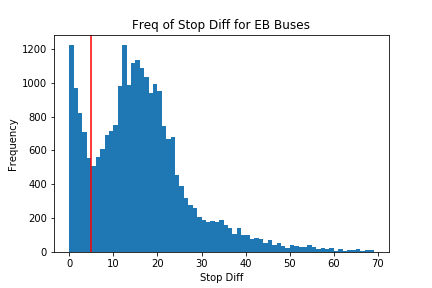
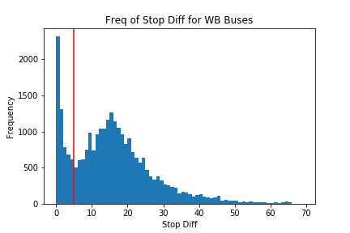
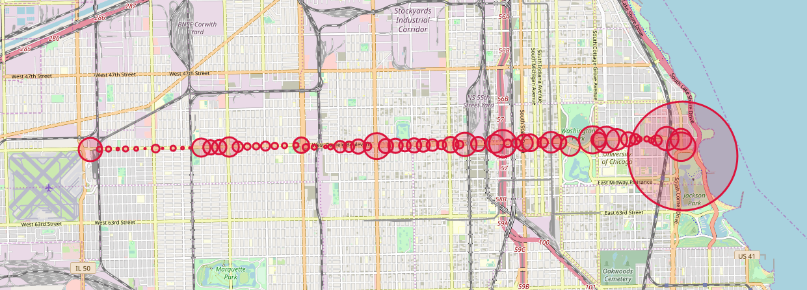
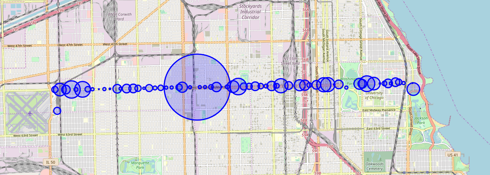

# cta_bus
Exploratory data analysis on bus bunching for the CTA 55 route.

Here are maps showing the locations of the most egregious occurrences of bus bunching. Area of circle markers correspond to proportion bus bunching occurrences associated with a given stop. Our definition of bus bunching will be an occurrence of two buses on the route at the same time closer than some threshold `n` stops apart (where `n` is threshold we define in the notebook based on the frequency of the number of stops between neighboring buses). In the case of this dataset, we make our threshold `n = 5`. So every time neighboring buses are <= 5 stops apart, we consider this to be an occurrence of bus bunching.

## Visualizations
#### Histograms of Number of Stops between Neighboring Buses

Open the HTML files in the `links/` directory to interact with the maps. Click the circles to reveal the stop names.
___
#### Bunching of Eastbound Buses on 55th St

#### Bunching of Westbound Buses on 55th St

## Potential TODO:
- implement binary search to dramatically cut time complexity of matching bus to closest stop
- analyze other routes and consider how to deal with more complex, non-linear routes
- consider constructing a classification model to predict whether a new proposed stop would introduce bunching on a route - features like whether the stop is a POI (MSI, Midway, Garfield Station), distance from neighboring stops, etc
